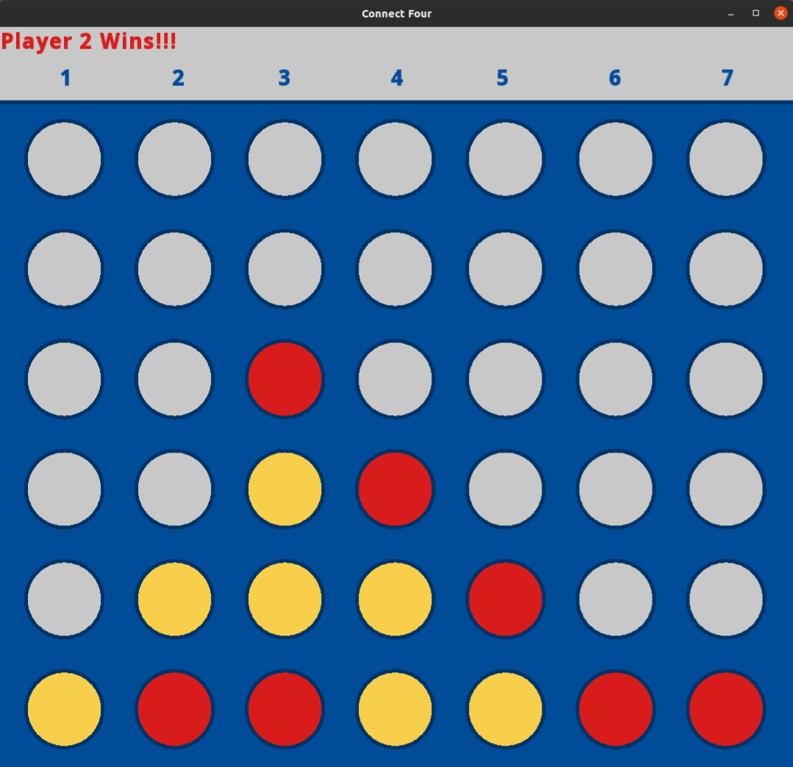

# Connect Four
Connect Four is a two-player connection board game, in which the players choose a color and then take turns dropping colored discs into a seven-column, six-row vertically suspended grid. The pieces fall straight down, occupying the lowest available space within the column. The objective of the game is to be the first to form a horizontal, vertical, or diagonal line of four of one's own discs. 

## Rules of the Game
1. Players must alternate turns and only one disc can be dropped in each turn.
2. On your turn, select any of the seven columns that you would like to drop your colored disc in.
3. The game ends when there is a 4-in-a-row or a stalemate.  

## Authors
### Brianna Lyon
Contributed to all aspects of the project, but focused their attention on game implementation.

### Josie Wicklund
Contributed to all aspects of the project, but focused their attention on the graphical user interface SFML.

## Project Status
This project was designed for the final project in our CS-151 course at North Idaho College. Due to the time constraints and unexpected challenges, we were unable to implement a more complex artificial intelligence such as the "minimax" algorithm. Neither of us intend on progressing further with the project as it currently stands. 
